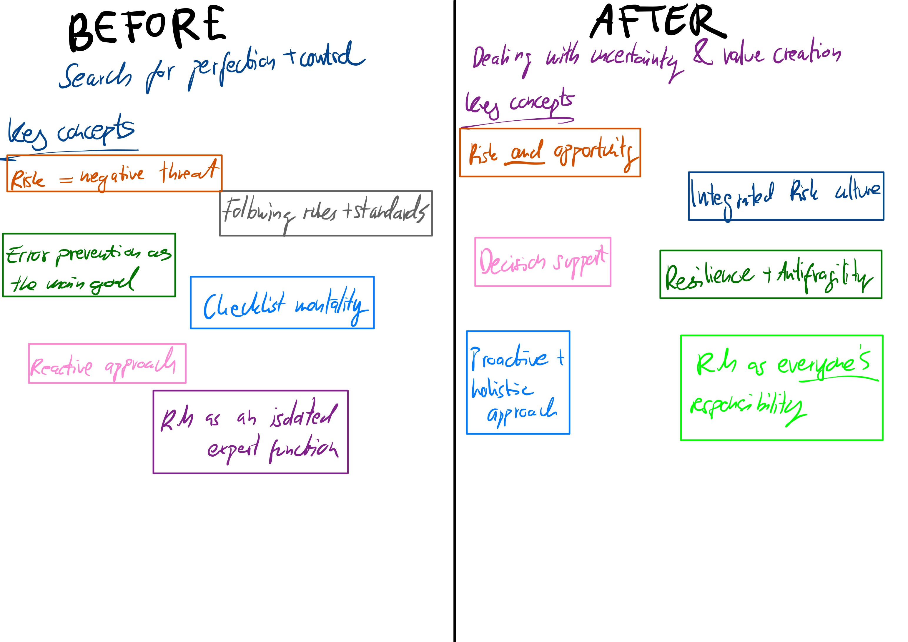
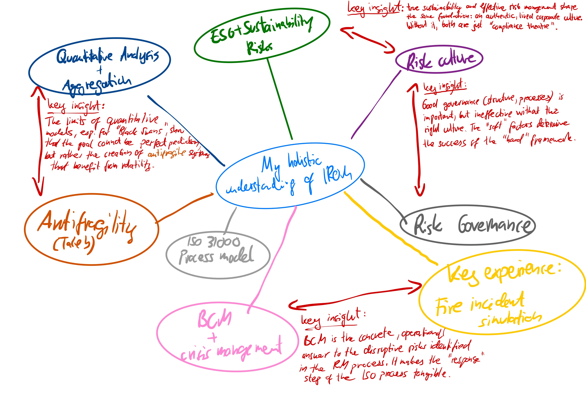
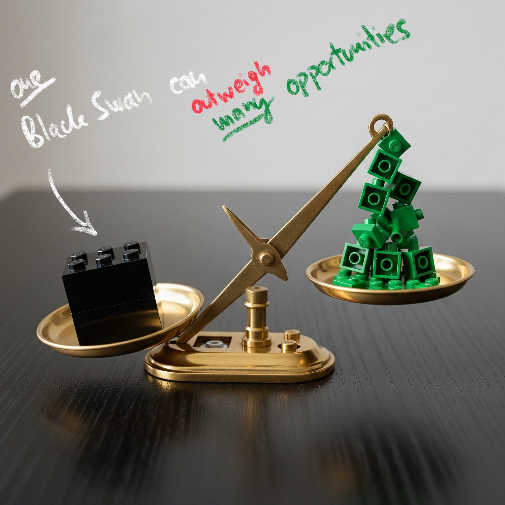
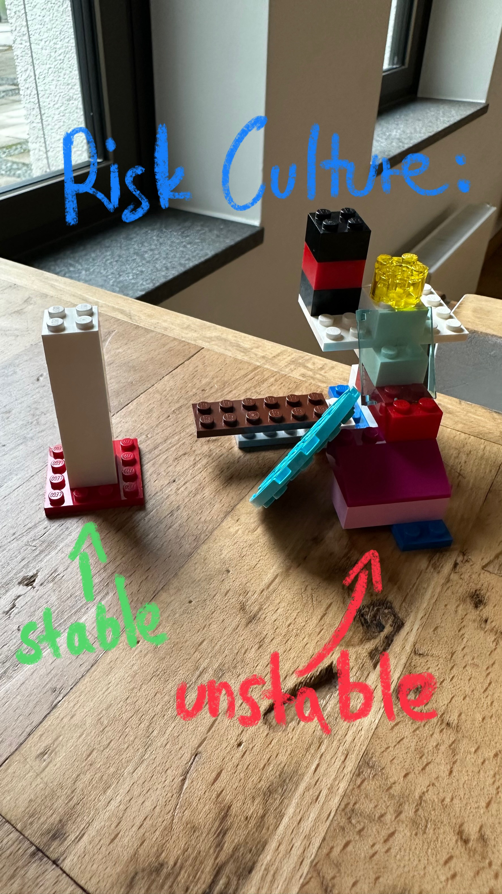
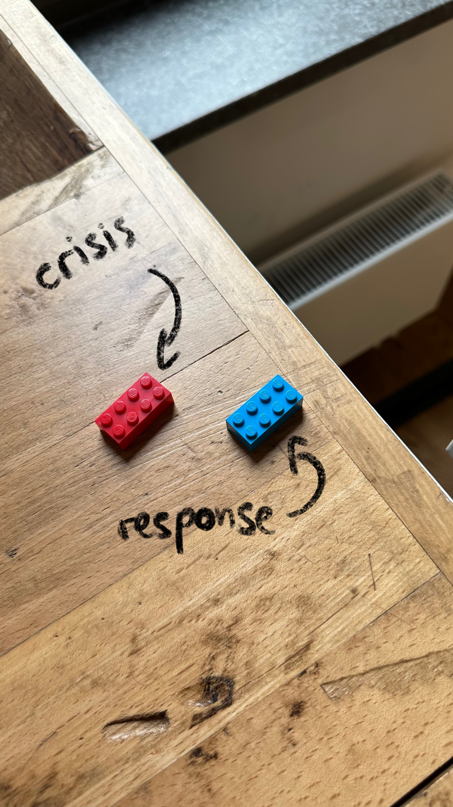
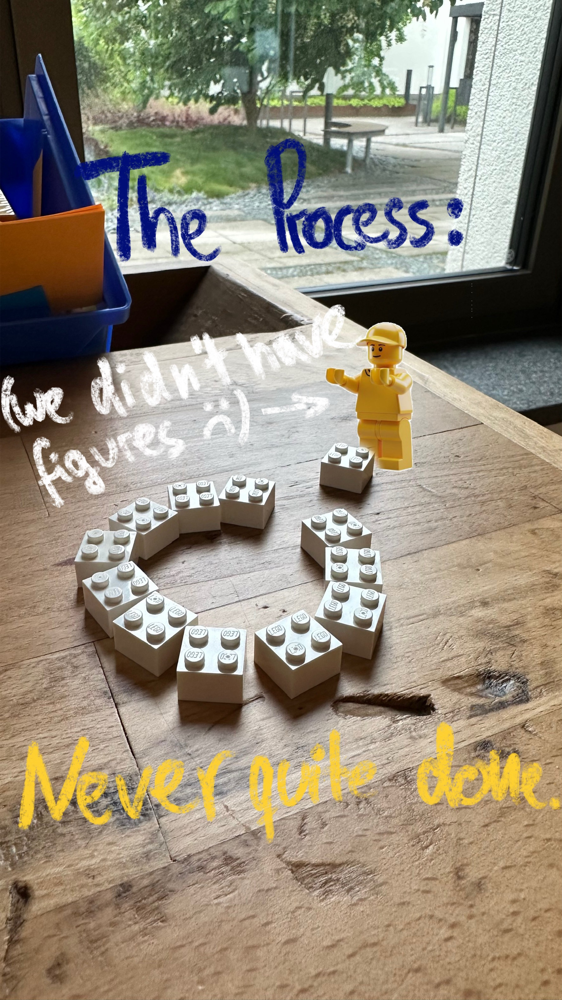

# Projekt-Fragebogen: Dein One-Pager

## Abschnitt 1: Welcome to my Journey

1. **Überschrift:**

   **Introduction: My Journey Begins**

   _This learning journal documents my personal and professional journey through the 'Risk Management' course. My goal is not only to reproduce the content I have learned, but above all to capture the process of gaining insight, my 'aha' moments, and the transformation of my own perspective on the topic of risk and opportunity._

   _At the beginning of the course, my understanding of risk management was heavily influenced by a desire for clear rules, structures, and 'perfect' solutions. I saw it as a primarily technical discipline for avoiding errors. This journal traces how this view has fundamentally changed—towards a holistic understanding of risk management as a dynamic, culture-driven, and value-adding process, in which dealing with uncertainty is a core competency._

   _Within this journal, I focus on those lecture topics that offered the greatest relevance and the deepest insights for my personal learning process and professional practice. Other important topics from the course are intentionally addressed more briefly or mentioned in the context of broader connections to maintain focus and stay within the scope of this portfolio. This selection reflects my individual path to internalizing the core principles of IROM._

   _To document this journey, I use a mixture of written reflections on key topics, a critical engagement with academic literature, as well as creative and practical elements like a video, a podcast excerpt, and conceptual visualizations. It is the story of how theoretical knowledge turned into a professional mindset._

2. **Visualisierung 1 (Vorher-Nachher-Schaubild):** 

   - Untertitel: My perspective at the beginning vs. my perspective today

3. **Visualisierung 2 (Mindmap):** 

   - Untertitel: Mindmap: My key learnings + understanding of IROM

## Abschnitt 2: Blog-Einträge

Hier kommen die separaten Textabschnitte rein. Kopiere den Block für jeden neuen Eintrag.

### Blog-Eintrag 1

1. **Titel des Eintrags:** Lectures No. 1 & 2 | From Risk Definitions to Antifragility: A Shift in Perspective
2. **Text des Eintrags:**

   The initial lectures of the course fundamentally shifted my perspective on risk management. My key initial learning was the departure from viewing risk purely as a negative threat (a perspective common in some traditional standards) to the modern, holistic understanding of risk as the 'effect of uncertainty on objectives' (ISO 31000). The realization that effective risk management must therefore also be opportunity management was a genuine 'aha' moment for me.  
   This broader perspective logically leads to the fascinating concept of _Antifragility_ by N. Taleb (2012). I find the idea that systems can actually benefit from stress, volatility, and disorder particularly compelling. I recognize this pattern both from observing my friend's tech startup navigating its chaotic growth phase and from managing my own demanding schedule between a Big4 consultancy role and this master’s program. The course provided a theoretical framework for this lived experience: the ultimate goal is not just to be resilient to pressure, but to become stronger through it. This insight into antifragile systems has fundamentally shaped my view on what truly effective risk and opportunity management aims to achieve.

### Blog-Eintrag 2

1. **Titel des Eintrags:** Lecture No. 3 | The Nuances of Process and Visualization
2. **Text des Eintrags:**

   My professional background in a Big4, working with standards like CSRD/ESRS and HGB/IFRS, meant that the formal structure of the ISO 31000 risk management process felt familiar. My key takeaway from this lecture was therefore less about the 'what' and more about the 'why' behind certain nuances.  
   An interesting detail, for example, was the deliberate shift in terminology from 'Risk Treatment' to 'Risk Response'. The reasoning that 'you can't treat an opportunity, but you can respond to it' aligns well with the modern, integrated approach that views risk and opportunity as two sides of the same coin of uncertainty.  
   I also reflected on the use of risk radars and heatmaps. While I appreciate their value as a powerful communication tool for providing management with an at-a-glance overview of top risks, I remain critically aware of their limitations regarding precision and their potential to oversimplify complex risk interdependencies. It's a classic trade-off between simplicity for decision-making and the accuracy of the underlying analysis.

### Blog-Eintrag 3

1. **Titel des Eintrags:** Lecture No. 4 | The Core Relevance of Risk Culture
2. **Text des Eintrags:**

   A central and lasting insight from the course came from the discussion on Risk Culture. My initial analysis of standards like ISO 31000 led to a critical observation noted down during the lecture: 'Problem: culture is mentioned nowhere in the ISO-Norms'. This highlighted for me that formal processes are merely the skeleton of an IROM system; its heart and nervous system are the organization's lived culture.  
   The most significant takeaway was the direct parallel to my professional work in sustainability. A company isn't sustainable just by complying with CSRD; it requires a genuine culture of sustainability. Likewise, an IROM system isn't effective just because a risk handbook exists. It succeeds when a culture of psychological safety encourages open communication about risks and errors. This realization leaves me with a key question for my future practice: How can we effectively and objectively measure risk culture to make it a tangible management asset?

### Blog-Eintrag 4

1. **Titel des Eintrags:** Lecture No. 5 & 6 | The Asymmetry of Risk and Opportunity: Beyond the Toolbox
2. **Text des Eintrags:**

   The discussion in Lectures 5 and 6 prompted a new line of thinking for me. As methods like FMEA were already familiar from my undergraduate studies, my attention was drawn less to the tools themselves and more to a fundamental question raised in the course: Can we, and should we, use the same techniques to manage downside risks as we do to pursue upside opportunities? This led me to consider the inherent asymmetry between them, which I have visualized in the "Asymmetrical Scale" illustration.

   
   Untertitel: AI-generated image w/ handwritten markdowns by author

### Blog-Eintrag 5

1. **Titel des Eintrags:** Lecture No. 8 | From chaos to control: My insights on BCM
2. **Text des Eintrags:**

   Although I was unable to attend the guest lecture on IT security (Lecture 7) due to professional commitments, its core topic—cyber incidents as a primary cause of business interruption—served as a direct lead-in to my reflections on BCM.
   My key experience from the course's fire incident simulation, where I witnessed the overwhelming chaos of a crisis, found its structured answer in the BCM session. My core insight was understanding that BCM is the practical bridge between knowing a risk (like a fire or IT outage) and having the concrete ability to remain operational. It provides the necessary toolkit of plans and defined responsibilities to manage chaos effectively. This led me to a crucial practical question: How can an organization ensure that BCM plans are not just 'shelfware,' but a living, tested reality that provides true resilience in a crisis?

### Blog-Eintrag 6

1. **Titel des Eintrags:** 9 & 10 | From Response to Value: The Strategic Aim of IROM
2. **Text des Eintrags:**

   The final lectures on 'Risk Response' and 'Improving IROM Systems' brought the entire risk management cycle to a strategic conclusion for me. While the core response strategies are straightforward, such as Avoid, Reduce, and Transfer, the concept of Bear/Tolerate' revealed a deeper level of maturity. It is not passive resignation, but an active, conscious decision based on a cost-benefit analysis, which requires a confident understanding of one's own risk appetite.
   This leads directly to the key insight from the final lecture: a mature _IROM system_ is not just a defensive necessity, but a proactive driver of sustainable value. The frameworks presented, such as the EFQM Model, clearly show that aspects like 'Driving Performance & Managing Risk' are directly linked to long-term success. The overarching aim is therefore not just to manage a list of risks, but to build a continuously improving, resilient organization that uses its understanding of risk and opportunity to make better strategic decisions and thereby consistently create value.

### Blog-Eintrag 7

1. **Titel des Eintrags:** Lecture 11 | A Practitioner's View: The Reality of Implementation
2. **Text des Eintrags:**

   The guest lecture by KPMG provided a crucial reality check and served as a capstone to the preceding course content. Seeing the multitude of topics we discussed, from risk culture to quantitative methods, condensed into a single, dense presentation underscored the immense complexity and scale of a well-functioning Risk Management System. It made tangible what a large 'apparatus' risk management truly is in practice. Against this backdrop of complexity, a specific comment from one of the presenters was particularly valuable. They remarked that we would be surprised at the initial quality of risk systems and reports from companies implementing them for the first time. This statement was profoundly reassuring. It normalized the feeling of being overwhelmed that I sometimes experienced during our challenging BEEH group project and throughout my own learning journey. It was a practical confirmation that navigating the gap between an ideal framework and the messy reality of implementation is a universal challenge, not a personal failing.

### Blog-Eintrag 8

1. **Titel des Eintrags:** Conclusion & Outlook: The Journey Continues
2. **Text des Eintrags:**

   Looking back, the journey through this Risk Management course has been one of profound transformation. I began with the expectation of learning a set of clear rules for managing risk, viewing it as a technical discipline aimed at perfection and control. I conclude the course with a fundamentally different and more holistic perspective: Risk Management is not about eliminating uncertainty, but about navigating it wisely. It is a dynamic, culture-centric, and value-adding process focused on enabling better decisions.  
   The most significant insight for me is that a proactive risk culture, rather than any single tool or process, is the true engine of an effective IROM system. This was powerfully complemented by the concept of antifragility, which provided a new lens through which to view challenges. The goal shifted from mere resilience (withstanding shocks) to building systems that can actually gain from disorder. This applies not just to organizations, but to navigating my own professional and academic development.  
   Moving forward in my career in consulting, particularly in the area of sustainability and ESG reporting, these insights are invaluable. They allow me to see beyond the technical compliance aspects of frameworks like CSRD and to advise on the deeper, cultural and strategic integration required for true organizational resilience. This course has not just provided me with knowledge; it has equipped me with a more robust and adaptive professional mindset.

## Abschnitt 3: Bilder & Texte im Wechsel

### Kombination 1 (Bild links, Text rechts)

1. **Bild 1:**

   

2. **Text 1:**
   _This image metaphorically depicts two organizational states. The stable, uniform white stack represents a strong, shared risk culture – the solid foundation upon which effective processes and strategies are built. In contrast, the chaotic, unstable stack illustrates how a weak or inconsistent culture creates inherent fragility, making any system built upon it vulnerable. This visualization reflects my key learning: a sound risk culture is the non-negotiable prerequisite for a resilient and successful IROM system, a topic I found particularly fascinating due to its parallels with establishing a true sustainability culture._

### Kombination 2 (Text links, Bild rechts)

1. **Bild 2:**

   

2. **Text 2:**
   _Inspired by the fire incident simulation in our course, this minimalist illustration uses two bricks to represent a core dynamic. The single red brick symbolizes the crisis event itself: the sudden alarm, the problem, the 'heat' of the moment. The blue brick represents the ideal response: a calm, structured, and controlled action designed to 'cool' the situation. This captures my realization that while we cannot always prevent a crisis, a mature risk management system prepares us to counter the 'red' of chaos with the 'blue' of a deliberate and effective response._

### Kombination 3 (Bild links, Text rechts)

1. **Bild 3:**

   

2. **Text 3:**
   _This image visualizes my learning that risk management is not a linear project with a defined endpoint, but a continuous, cyclical process. The circle represents the IROM framework, and the (cropped-out) minifigure about to place the 'final' brick symbolizes the ongoing effort required for monitoring, reviewing, and improving the system. It illustrates that the process is never truly 'done,' reflecting the principle of continuous improvement that I initially found challenging to accept due to its demanding nature._

## Abschnitt 4: Critical Review of a recent scientific article

1. **Titel des Eintrags:** Critical Review of the Article "Enterprise Risk Management: Improving Embedded Risk Management and Risk Governance" by W. Gleissner & T. B. Berger
2. **Text des Eintrags:**

   The article "Enterprise Risk Management: Improving Embedded Risk Management and Risk Governance" (Gleissner & Berger, _Risks_, 2024) outlines pathways to an integrated, value-oriented ERM. The authors call for a decision-driven approach that aims to enhance resilience and sustainable corporate success through quantitative risk aggregation and a deeply embedded Risk Management that is anchored in all processes.  
   The article's primary contribution is the recognition of the need for a holistic approach to risk management. It argues that the traditional approach of ERM is often seen as restrictive and not aligned with the needs of modern organizations. The authors propose a decision-supporting and value-oriented ERM that is deeply embedded in strategy and processes, thereby enhancing resilience and sustainable corporate success.  
   The paper provides a valuable contribution to the evolution of ERM. Its strengths lie in the clear focus on a decision-supporting and value-oriented ERM that is deeply embedded in strategy and processes, marking a distinct departure from purely compliance-focused approaches. The particular relevance of this integrated approach becomes evident in innovation-driven processes. Here, the traditional perception of risk management as potentially inhibiting innovation must be overcome, as it is often seen as restrictive, whereas innovation requires flexibility **(cf. Joubert, 2016, p. 6)**. Equally timely is the call for quantitative risk aggregation, which reflects the ongoing professionalization of the field. A key challenge in this regard is the realistic modeling of dependencies between risks; for example, in the hotel industry, the risk of an extreme heatwave and the risk of rising energy costs can be closely linked. The academic literature discusses specialized approaches for this, such as Copula Theory, which make it possible to model the dependency structure between risks separately from their individual characteristics and thus create a valid overall picture **(cf. Scherer & Zagst, 2015, pp. 129-145)**.  
   At the same time, the sophisticated proposals present implementation challenges. Establishing such a comprehensive system is particularly demanding for SMEs or organizations with lower RM maturity. The necessity of a phased development is addressed in literature through maturity models, which serve as tools for the qualitative assessment of existing practices against a defined standard **(cf. Chamoun et al., 2019, p. 4)**. Furthermore, the strong focus on internal enterprise value could be complemented by a participatory perspective that systematically incorporates the values of external stakeholders to foster the acceptance of decisions in complex environments **(cf. Daniell et al., 2008, pp. 970-971)**.  
   In summary, the article provides valuable and forward-looking impulses for a modern ERM that functions as a genuine value driver. Despite practical implementation challenges, the contribution motivates a consistent, decision-oriented approach to risk management and the professionalization of its governance structures.

## Abschnitt 5: Multimedia

1. **Video:** My Key Learning during your Risk Management course

   

2. **Audio/Podcast:**

   

Untertitel: Excerpt from a conversation between me and my colleague Lukas

## Abschnitt 6: Rechtliches & Quellen

### Disclaimer zur Nutzung von Künstlicher Intelligenz (KI) bei der Erstellung dieser Hausarbeit

Im Rahmen der Erstellung dieser Hausarbeit wurden KI-gestützte Anwendungen eingesetzt, um spezifische Aufgaben zu unterstützen. Diese Aufgaben umfassen:

- Die Korrektur von Rechtschreib- und Grammatikfehlern
- Die Übersetzung von Texten (DeepL)

Die Verwendung dieser KI-Tools erfolgte mit der Absicht, den wissenschaftlichen Schreibprozess zu unterstützen und zu optimieren. Alle von den KI-Tools generierten Inhalte wurden gründlich überprüft und gegebenenfalls angepasst, um sicherzustellen, dass sie den akademischen Standards und ethischen Richtlinien dieser Hochschule entsprechen.

Ich bestätige hiermit, dass die KI-Tools lediglich als Hilfsmittel dienten und dass die Inhalte dieser Arbeit maßgeblich auf eigenständiger Forschung und Analyse basieren. Jede direkte Übernahme von durch KI generierten Texten oder Ideen wurde entsprechend kenntlich gemacht und korrekt zitiert.

Die Verantwortung für den Inhalt dieser Abgabe, einschließlich der Originalität, liegt vollständig bei mir als Verfasser.

Hannover, 15.06.2025

Wanja Hummel  

### Eidesstattliche Versicherung

Ich versichere des Eides statt, dass die vorliegende Abgabe mit dem Titel: **„Risk Management: My Learning Journal“** von mir selbstständig, ohne Hilfe Dritter und ausschließlich unter der Verwendung der angegebenen Quellen angefertigt wurde. Alle Stellen, die wörtlich oder sinngemäß aus Veröffentlichungen entnommen sind, habe ich als solche kenntlich gemacht. Die Arbeit wurde bisher in gleicher oder ähnlicher Form, auch nicht in Teilen, in keiner anderen Prüfungsbehörde vorgelegt und auch nicht veröffentlicht.

Hannover, 15.06.2025

Wanja Hummel  

### Literaturverzeichnis

Adam, P. A. (2024a). _Integrated Risk and Opportunity Management (IROM). The eight essentials of a modern management approach_ [Whitepaper]. [www.patricia-adam.com](https://www.patricia-adam.com/)
Adam, P. A. (2024b). _Risiken und Chancen integriert managen: Ein praxiserprobter Ansatz für den Mittelstand_. Springer Gabler.
Chamoun, E., Denewet, N., Manzanera, A., & Matai, S. (2019). _Risk management maturity assessment at central banks_ (IMF Working Paper No. 19/303). International Monetary Fund.
Gleißner, W. (2017). _Grundlagen des Risikomanagements: Mit kompakten Fallstudien_ (3. Aufl.). Verlag Franz Vahlen.
Hopkin, P. (2010). _Fundamentals of risk management: Understanding, evaluating and implementing effective risk management_. Kogan Page.
International Organization for Standardization. (2018). _Risk management — Guidelines_ (ISO 31000:2018).
International Organization for Standardization. (2019). _Security and resilience — Business continuity management systems — Requirements_ (ISO 22301:2019).
International Organization for Standardization. (2021). _Compliance management systems — Requirements with guidance for use_ (ISO 37301:2021).
Daniell, K. A., Coad, P., Ferrand, N., White, I., Jones, N., Guise, K., Marvell, C., Burn, S., & Perez, P. (2008). Participatory values-based risk management for the water sector. In _Proceedings of the Fourth International Conference on Water Resources and Environment Research (ICWRER) "Water Down Under 2008"_ (pp. 969–981)
Joubert, J. (2016). _Embedding risk management within new product and service development..._ [Doctoral dissertation, University of Cape Town]. University of Cape Town.
Romeike, F., & Hager, P. (2020). _Erfolgsfaktor Risiko-Management 4.0: Methoden, Beispiele, Checklisten_ (4., vollständig überarbeitete und erweiterte Aufl.). Springer Gabler.
Scherer, M., & Zagst, R. (2015). An overview of copula theory. In K. Glau, M. Scherer, & R. Zagst (Eds.), _Innovations in quantitative risk management_ (pp. 129-145). Springer.
Taleb, N. N. (2012). _Antifragile: Things that gain from disorder_. Random House.
